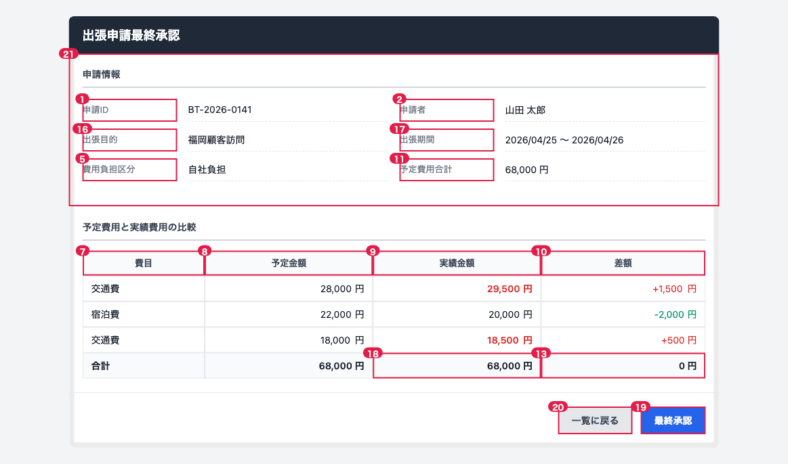

# SCREEN-BT-05 出張申請最終承認

## この画面の業務的役割

出張実績が登録された申請に対して、承認者（申請者の上長）が予定費用と実績費用を照合し `behavior 最終承認する` を呼び出す画面。最終承認が完了すると `最終承認` 状態へ遷移し、経理連携が行われる。一覧画面から `出張実績あり` 状態の行を承認者がクリックして遷移してくる。

## 関連する behavior

- `behavior 最終承認する` ([仕様モデル](../../spec-model/business-trip.md))

この画面が表示する `data`。

- `data 出張実績` ([仕様モデル](../../spec-model/business-trip.md))
- `data 最終承認` ([仕様モデル](../../spec-model/business-trip.md))

## 想定利用ユーザ

- 主アクター: 承認者（`data 承認者 = 社員` のうち role >= MANAGER、かつ申請者の上長）
- 副アクター: なし

## レイアウトバリアント

### PC版

<ScreenLayout src="layout/SCREEN-BT-05-pc.html" height="800px" />

番号は下の項目テーブルの No 列と対応します。

#### 画面項目グループ: 申請情報（参照）領域

| No | 項目名 | 種別 | 派生元 | 編集仕様 | 必須 | 初期値 | 表示条件 |
| -- | ------ | ---- | ------ | -------- | ---- | ------ | -------- |
| 1 | 申請ID | label | `出張実績.出張予定.id` | BT-{yyyy}-{連番4桁} | − | − | 常に表示 |
| 2 | 申請者 | label | `出張実績.出張予定.List<出張者>` | 氏名（複数人は「、」区切り） | − | − | 常に表示 |
| 3 | 出張目的 | label | `出張実績.出張予定.出張目的` | そのまま表示 | − | − | 常に表示 |
| 4 | 出張期間 | label | `出張実績.出張予定.出張期間` | yyyy/MM/dd 〜 yyyy/MM/dd | − | − | 常に表示 |
| 5 | 費用負担区分 | label | `出張実績.出張予定.費用負担区分` | 「自社負担」または「先方負担」 | − | − | 常に表示 |
| 6 | 予定費用合計 | label | `sum(出張実績.出張予定.出張予定費用.予定金額)` | #,##0 円 | − | − | 常に表示 |
| 7 | 申請情報 申請ID BT-2026-0141 申請者 山田 太郎 出張目的 福岡 | label | − | − | − | − | − |

#### 画面項目グループ: 費用比較領域

予定費用と実績費用を並べて表示し、差異を確認しやすくする。

| No | 項目名 | 種別 | 派生元 | 編集仕様 | 必須 | 初期値 | 表示条件 |
| -- | ------ | ---- | ------ | -------- | ---- | ------ | -------- |
| 8 | 費目 | label | `出張予定日程.費目` / `出張実績日程.費目` | 「交通費」「宿泊費」「交際費」 | − | − | 各行 |
| 9 | 予定金額 | label | `出張予定日程.予定金額` | #,##0 円 | − | − | 各行 |
| 10 | 実績金額 | label | `出張実績日程.実績金額` | #,##0 円。予定超過の場合は赤字表示 | − | − | 各行 |
| 11 | 差額 | label | `出張実績日程.実績金額 - 出張予定日程.予定金額` | #,##0 円（派生計算。超過時は +XXX円と表示） | − | − | 各行 |
| 12 | 予定費用合計 | label | `sum(出張予定日程.予定金額)` | #,##0 円 | − | − | フッタ行 |
| 13 | 実績費用合計 | label | `sum(出張実績日程.実績金額)` | #,##0 円 | − | − | フッタ行 |
| 14 | 差額合計 | label | `sum(実績金額) - sum(予定金額)` | #,##0 円（派生計算） | − | − | フッタ行 |

#### 画面項目グループ: 操作領域

| No | 項目名 | 種別 | 派生元 | 編集仕様 | 必須 | 初期値 | 表示条件 |
| -- | ------ | ---- | ------ | -------- | ---- | ------ | -------- |
| 15 | 最終承認ボタン | button | − | ラベル「最終承認」 | − | − | role >= MANAGER かつ 操作ユーザが申請者の上長 |
| 16 | 戻るボタン | button | − | ラベル「一覧に戻る」 | − | − | 常に表示 |

### スマホ版

<ScreenLayout src="layout/SCREEN-BT-05-mobile.html" height="900px" />

費用比較はスクロール表示。操作ボタンは画面下部に固定。

#### 画面項目グループ: 申請情報（参照）領域（スマホ）

| No | 項目名 | 種別 | 派生元 | 編集仕様 | 必須 | 初期値 | 表示条件 |
| -- | ------ | ---- | ------ | -------- | ---- | ------ | -------- |
| 1 | 出張目的 | label | `出張実績.出張予定.出張目的` | 全角20文字超は省略 | − | − | 常に表示 |
| 2 | 出張期間 | label | `出張実績.出張予定.出張期間` | MM/dd 〜 MM/dd | − | − | 常に表示 |
| 3 | 実績費用合計 | label | `sum(出張実績日程.実績金額)` | #,##0 円 | − | − | 常に表示 |

#### 画面項目グループ: 費用比較領域（スマホ）

PC版と同じ項目。横スクロール表示。

#### 画面項目グループ: 操作領域（スマホ）

| No | 項目名 | 種別 | 派生元 | 編集仕様 | 必須 | 初期値 | 表示条件 |
| -- | ------ | ---- | ------ | -------- | ---- | ------ | -------- |
| 4 | 最終承認ボタン | button | − | 画面下部右に固定配置 | − | − | role >= MANAGER かつ 操作ユーザが申請者の上長 |
| 5 | 戻るボタン | button | − | 画面下部左に固定配置 | − | − | 常に表示 |

## 画面イベント

| イベント名       | 発生タイミング              | サーバ通信 | 対応する behavior / API                                                              | 正常時遷移先                  |
| ---------------- | --------------------------- | ---------- | ------------------------------------------------------------------------------------ | ----------------------------- |
| onFinalApprove   | 最終承認ボタン onClick       | あり_同期  | `behavior 最終承認する` / POST /api/v1/business-trips/{id}/final-approve             | [SCREEN-BT-01](SCREEN-BT-01-business-trip-list.md)（最終承認完了トースト）|
| onBack           | 戻るボタン onClick           | なし       | −                                                                                    | [SCREEN-BT-01](SCREEN-BT-01-business-trip-list.md) |

### イベント詳細

#### onFinalApprove

- バリデーション: なし（表示内容を確認して承認ボタンを押すのみ）
- 呼び出す behavior / API: `behavior 最終承認する` / POST /api/v1/business-trips/{id}/final-approve
- 遷移条件:
  - 200 OK → SCREEN-BT-01 へ遷移し「最終承認しました。経理連携が完了しました」とトースト
  - 409 InvariantViolation → 「他の操作によって状態が変わりました」とトーストし再読み込み
  - 403 AuthorizationError → 「承認権限がありません」とエラー表示
  - サーバエラー → エラー画面へ

## 業務的事前条件・事後条件

- 事前条件: 対象申請が `出張実績` 状態であること。操作ユーザが申請者の上長（role >= MANAGER）であること
- 事後条件: onFinalApprove 完了後は `最終承認` 状態へ遷移。経理連携が行われる（`behavior 最終承認する` の Why: 立て替えた金額を経理に連携する）

## 影響する集約・データ

- [`出張実績`](../../spec-model/business-trip.md)
- [`最終承認`](../../spec-model/business-trip.md)

## アクセス制御

- 認証必須: はい
- 必要ロール: SALES_VIEWER 以上（閲覧）、SALES_MANAGER 以上（最終承認操作）
- 動的な表示制御: 最終承認ボタンの表示条件で制御（上の表参照）

## 受け入れ基準

| ケース               | 操作                                              | 期待結果                                                             |
| -------------------- | ------------------------------------------------- | -------------------------------------------------------------------- |
| 正常系               | MANAGER が最終承認ボタンをクリック                | 最終承認状態に遷移し一覧に戻る。「最終承認しました」トースト         |
| 業務エラー（権限なし）| 上長でないユーザが最終承認ボタンをクリック        | 「承認権限がありません」が表示され、画面遷移しない                   |
| 状態不整合           | 既に最終承認済みの申請で承認ボタンをクリック      | 「他の操作によって状態が変わりました」とトーストし再読み込み          |

実装場所: `e2e/business-trip/final-approve.spec.ts`

## 実装への対応

- フロント側コンポーネント: `src/screens/business-trip/BusinessTripFinalApproveScreen.tsx`
- レスポンシブ実装方針: CSS メディアクエリ（breakpoint: 768px）でレイアウト切り替え。費用比較テーブルはスマホで横スクロール
- 関連 ADR: [ADR-001](../../../adrs/ADR-001-data-mapper.md)

## 派生元参照のチェック

- すべての項目に派生元が書かれているか: ○（button は `−` と明示）
- Core にない項目を画面側で発明していないか: ○（差額・差額合計は派生計算として明示）
- 派生計算が `<関数名>(<引数>)` の形式で書かれているか: ○

## 関連 Shell

- API: [../api/business-trip-api.md](../api/business-trip-api.md)
- 永続: [../persistence/business-trip-table.md](../persistence/business-trip-table.md)
