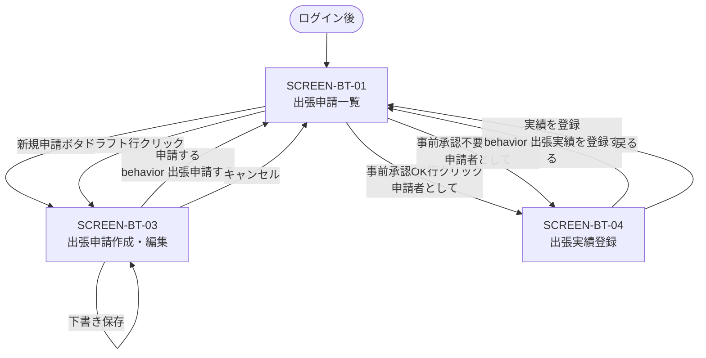
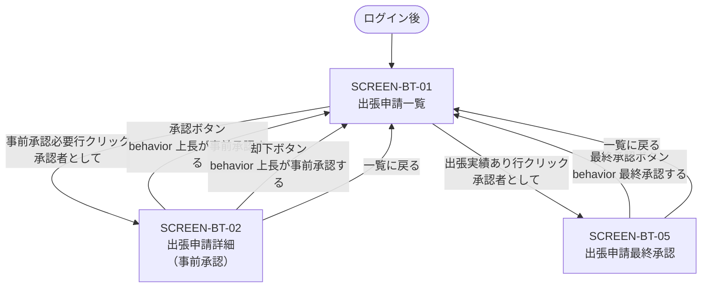
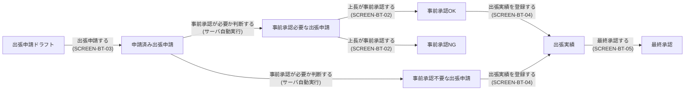

# 出張申請システム 画面遷移

## 申請者フロー

申請者が出張申請を作成し、実績を登録するまでの遷移。

## 承認者フロー

承認者が事前承認・最終承認を行うまでの遷移。

## 申請状態と画面遷移の全体図

申請の状態遷移と画面の対応関係を1枚に示す。

## 遷移詳細

### 申請者フロー

| 遷移元 | 遷移先 | トリガ | 対応する behavior | 備考 |
| ------ | ------ | ------ | ----------------- | ---- |
| [SCREEN-BT-01](SCREEN-BT-01-business-trip-list.md) | [SCREEN-BT-03](SCREEN-BT-03-business-trip-create.md) | 新規申請ボタン onClick | − | 新規作成モード |
| [SCREEN-BT-01](SCREEN-BT-01-business-trip-list.md) | [SCREEN-BT-03](SCREEN-BT-03-business-trip-create.md) | ドラフト行クリック | − | 編集モード。申請IDをパスパラメータで渡す |
| [SCREEN-BT-03](SCREEN-BT-03-business-trip-create.md) | [SCREEN-BT-01](SCREEN-BT-01-business-trip-list.md) | 申請するボタン onClick（成功時） | `behavior 出張申請する` | 申請完了トースト |
| [SCREEN-BT-03](SCREEN-BT-03-business-trip-create.md) | [SCREEN-BT-01](SCREEN-BT-01-business-trip-list.md) | キャンセルボタン onClick | − | |
| [SCREEN-BT-01](SCREEN-BT-01-business-trip-list.md) | [SCREEN-BT-04](SCREEN-BT-04-business-trip-actuals.md) | 事前承認OK / 事前承認不要行クリック（申請者） | − | 申請IDをパスパラメータで渡す |
| [SCREEN-BT-04](SCREEN-BT-04-business-trip-actuals.md) | [SCREEN-BT-01](SCREEN-BT-01-business-trip-list.md) | 実績を登録ボタン onClick（成功時） | `behavior 出張実績を登録する` | 登録完了トースト |
| [SCREEN-BT-04](SCREEN-BT-04-business-trip-actuals.md) | [SCREEN-BT-01](SCREEN-BT-01-business-trip-list.md) | 戻るボタン onClick | − | |

### 承認者フロー

| 遷移元 | 遷移先 | トリガ | 対応する behavior | 備考 |
| ------ | ------ | ------ | ----------------- | ---- |
| [SCREEN-BT-01](SCREEN-BT-01-business-trip-list.md) | [SCREEN-BT-02](business-trip-detail-screen.md) | 事前承認必要行クリック（承認者） | − | 申請IDをパスパラメータで渡す |
| [SCREEN-BT-02](business-trip-detail-screen.md) | [SCREEN-BT-01](SCREEN-BT-01-business-trip-list.md) | 承認ボタン onClick（成功時） | `behavior 上長が事前承認する` | 承認完了トースト |
| [SCREEN-BT-02](business-trip-detail-screen.md) | [SCREEN-BT-01](SCREEN-BT-01-business-trip-list.md) | 却下ボタン onClick（成功時） | `behavior 上長が事前承認する` | 却下完了トースト |
| [SCREEN-BT-02](business-trip-detail-screen.md) | [SCREEN-BT-01](SCREEN-BT-01-business-trip-list.md) | 一覧に戻るボタン onClick | − | |
| [SCREEN-BT-01](SCREEN-BT-01-business-trip-list.md) | [SCREEN-BT-05](SCREEN-BT-05-business-trip-final-approve.md) | 出張実績あり行クリック（承認者） | − | 申請IDをパスパラメータで渡す |
| [SCREEN-BT-05](SCREEN-BT-05-business-trip-final-approve.md) | [SCREEN-BT-01](SCREEN-BT-01-business-trip-list.md) | 最終承認ボタン onClick（成功時） | `behavior 最終承認する` | 最終承認完了トースト |
| [SCREEN-BT-05](SCREEN-BT-05-business-trip-final-approve.md) | [SCREEN-BT-01](SCREEN-BT-01-business-trip-list.md) | 一覧に戻るボタン onClick | − | |

## 共通遷移

| 遷移元 | 遷移先 | トリガ | 備考 |
| ------ | ------ | ------ | ---- |
| 任意の画面 | ログイン画面 | 認証エラー（401） | 全画面共通インターセプタで処理 |
| 任意の画面 | エラー画面 | サーバエラー（500） | 全画面共通インターセプタで処理 |
| 任意の画面 | ログイン画面 | ログアウト操作 | セッションクリア後に遷移 |

## デバイスごとの遷移差

PC版とスマホ版で遷移構造は同じ。スマホ版固有の差異は各画面ドキュメントのスマホ版セクションを参照。

## 関連ドキュメント

- [screen-catalog.md](screen-catalog.md): 画面一覧
- [仕様モデル](../../spec-model/business-trip.md): 仕様モデル（Core）— 申請状態の定義
