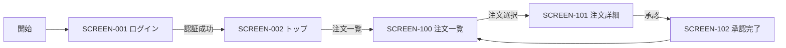

# 画面遷移

機能ごと、業務フローごとの画面遷移関係を示します。Traditional SI 設計書の §6 画面遷移図と §3.4.4 画面イベント一覧の遷移情報をテキスト DSL（Mermaid）で書き出したものです。

## 機能別の遷移

### 機能: <機能名>

#### 遷移詳細

| 遷移元 | 遷移先 | トリガ | 対応する behavior | 備考 |
| ------ | ------ | ------ | ----------------- | ---- |
| [SCREEN-001](SCREEN-001-<name>.md) | [SCREEN-002](SCREEN-002-<name>.md) | 認証成功 | (Shell の認証フロー) | エラー時は本画面に留まる |
| [SCREEN-100](SCREEN-100-<name>.md) | [SCREEN-101](SCREEN-101-<name>.md) | 注文選択（行クリック） | (画面遷移のみ) | 注文IDをクエリパラメータで渡す |
| [SCREEN-101](SCREEN-101-<name>.md) | [SCREEN-102](SCREEN-102-<name>.md) | 承認ボタン | `behavior 注文を承認する` ([../../../spec-model/behavior/<file>.md](../../../spec-model/behavior/<file>.md)) | API 呼び出し成功時 |

## 共通遷移

ログアウト・エラー画面・タイムアウトなど、機能横断の遷移をここにまとめます。

| 遷移元 | 遷移先 | トリガ | 備考 |
| ------ | ------ | ------ | ---- |
| 任意の画面 | [SCREEN-ERR-401](SCREEN-ERR-401-unauthorized.md) | 認証エラー | 全画面共通のインターセプタで処理 |
| 任意の画面 | [SCREEN-ERR-500](SCREEN-ERR-500-server-error.md) | サーバエラー | 全画面共通のインターセプタで処理 |
| 任意の画面 | [SCREEN-LOGIN](SCREEN-LOGIN.md) | ログアウト | セッションクリア後に遷移 |

## デバイスごとの遷移差

PC版とスマホ版で遷移が異なる場合のみ記述します。同じならこのセクションは削除します。

### スマホ版固有の遷移

| 遷移元 | 遷移先 | トリガ | 備考 |
| ------ | ------ | ------ | ---- |
| (例) [SCREEN-101](SCREEN-101-<name>.md) | [SCREEN-101-DETAIL-MODAL](SCREEN-101-detail-modal.md) | 詳細展開 | スマホでは折りたたみではなくモーダルで詳細表示 |
